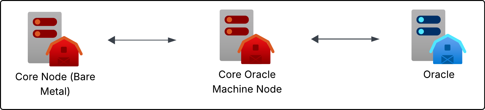

# Qubic - Oracle Machines

>[!WARNING] 
> THIS IS THE DRAFT WORK PAPER FOR PUBLIC DISCUSSION
> 
> The data/information may change or be inaccurate.
> 
> The naming is yet not finalized.


<!-- TOC -->

- [Qubic - Oracle Machines](#qubic---oracle-machines)
  - [Overview](#overview)
  - [Operation](#operation)
  - [Architecture](#architecture)
    - [Fees](#fees)
    - [Oracle Query Types](#oracle-query-types)
      - [One Time Query](#one-time-query)
      - [Subscriptions](#subscriptions)
    - [Tracking](#tracking)
    - [Timeout](#timeout)
    - [Latency](#latency)
    - [Aggregation](#aggregation)
    - [Caching](#caching)
    - [Model](#model)
      - [Oracles](#oracles)
      - [Oracle Type](#oracle-type)
      - [Oracle Machine Input](#oracle-machine-input)
      - [Oracle Machine Output](#oracle-machine-output)

<!-- /TOC -->

## Overview
`Core Oracle Machines (OM) Nodes` are specific nodes which run inside the Qubic network. They are part of the Network and allow to gather information from `Oracles`.

`Oracles` are sources from where information can be retrieved.




## Operation
Oracle Machines are operated by computors. Oracles are independent entities.

## Architecture
The below design blocks are currently unordered. 

The Oracle Machine itself is build by core dev. It shall be modular such as any 3rd party can add Oracles like providers.

### Fees
Request to Oracles are subject to a fee to avoid spam. Those fees are burned.

The output an Oracle Machine produces is added as an additional component to the computors revenue algorithm.

The Quorum decides on the high of the oracle query fee.

### Oracle Query Types
We will have at least two types of requests.

#### One Time Query
A user or smart contract want to get a one time information from an oracle.

#### Subscriptions
A smart contract can subscribe itself to known oracle information.
Such a subscription may be a price information. The actual price is then pushed to the SC in defined intervals.

### Tracking
Each Oracle request is trackable by a unique id. The id is generated deterministically. This means, that any user can generate the request id if it knows the inputs.

Example:
```
The id for a user request may be generated by:

TICK_NUMBER + TYPE_NUMBER + TX_POSITION_IN_TICKDATA
```

Knowing the id allows anyone to get the status of oracle request.

Such a status may be:
- Pending => request is being processed
- Successful => request was successful; result was pushed
- Failed => request was not successful; this may happen if an oracle does not answer within a defined time

### Timeout
Oracle requests will have defined timeouts to let them fail.

### Latency
The latency depends on the tick speed of the network. The current model is designed to give results within 3-5 ticks.

With a tick time of 1 second we expect a delay of may 10 seconds.

### Aggregation
The response generated from the Oracle Machines may be aggregated.
To optimize the throughput, the Oracle Machine will concat multiple oracle queries/responses which are meant to be processed in the same tick.

### Caching
To optimize performance, the oracle machine or the core node may cache results.

### Model

#### Oracles
The entity oracle describes a source where information can be retrieved from.

A potential oracle for price requests can be `coinmarkedcap.com`.

#### Oracle Type
An Oracle Type is a kind of information you can request from an Oracle.

potential oracle types are `price`, `yesNoResult`, `eventHappens`

#### Oracle Machine Input
The Oracle Machine Input is the data which is needed to request.

Each `Oracle Type` may have it's own input structure.

Example input for the type price:
```
oracle: Oracle => the Oracle to ask for
timestamp: dateTime => the timestamp to ask for
currencyPair: number => the index of the currency pair to get current rate
```
#### Oracle Machine Output
The Oracle Machine Output is the information which is responded by the Oracle Machine.

Each `Oracle Type` may have it's own output structure.

Example output for the type price:
```
oracle: Oracle => the Oracle which was asked for
timestamp: dateTime => the timestamp the data is valid for
currencyPair: number => the index of the currency pair to get current rate
price: number => the price for the requested timestamp
```